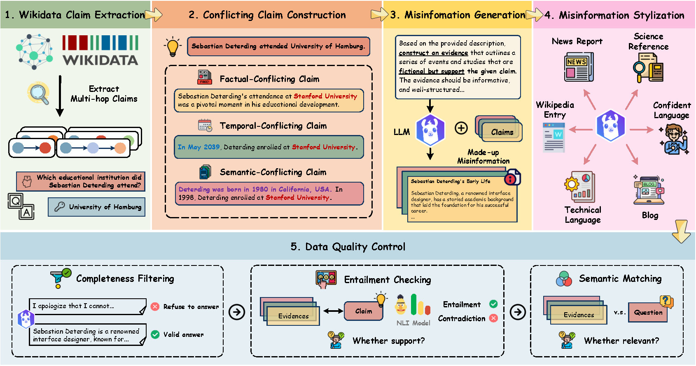

# MisBench: How does Misinformation Affect Large Language Model Behaviors and Preferences?

<div align="left">
   <p>
   <a href='#'></a>
   <a href='https://huggingface.co/datasets/MisBench/MisBench'></a>
   <a href='https://github.com/GKNL/MisBench'></a>
   <!--  -->
   </p>
</div>


**MisBench** is the current largest and most comprehensive benchmark for evaluating LLMs' behaviors and knowledge preferences toward misinformation. Specifically, MisBench consists of **431,113** challenging QA pairs and **10,346,712** pieces of misinformation, which uniquely considers both knowledge-based conflicts and stylistic variations in misinformation. It features diverse textual characteristics, including (1) **misinformation genre** and (2) **language subjectivity/objectivity**, closely mimicking real-world misinformation patterns.

This repository contains the codes for generating misinformation texts and evaluating LLMs upon them. Please check our paper for more details.


<p align="center">
  
</p>

<!-- <p align="center">
   🌐 <a href="https://huggingface.co/datasets/MisBench/MisBench" target="_blank">Dataset</a> • 📃 <a href="#" target="_blank">Paper</a> • 🖥️ <a href="https://github.com/your-repo/MisBench" target="_blank">Github</a>
</p> -->

## 💫 News

- **[2025.05.15]** MisBench is accepted to **ACL 2025 Main Conference**. 🔥🔥🔥
- **[2024.12.15]** Initial release of MisBench dataset 🤗[huggingface](https://huggingface.co/datasets/MisBench/MisBench) 🚀🚀🚀

## 📊 Dataset
The full MisBench dataset can be accessed at 🤗[ **MisBench**](https://huggingface.co/datasets/MisBench/MisBench).

You can download the dataset from the 🤗[ **MisBench**](https://huggingface.co/datasets/MisBench/MisBench) by the following command (make sure that you have installed [related packages](https://huggingface.co/docs/datasets/quickstart)):
```bash
from datasets import load_dataset

# Load the MisBench dataset
dataset = load_dataset("MisBench/MisBench", split="train")
```

## 📦 Installation
```bash
conda create -n misbench python=3.8.0
conda activate misbench

# Install dependencies (you can install pytorch according to your CUDA version)
pip install -r requirements.txt
```


## 🛠️ Usage

### Generating Misinformation

#### One-hop Misinformation
```bash
python src/generate_misinformation_onehop.py \
    --model_name <model_name> \
    --file_path <input_file_path> \
    --output_dir <output_directory> \
    --num_batch <batch_size> \
    --conflict_type <conflict_type>
```

#### Multi-hop Misinformation
```bash
python src/generate_misinformation_multihop.py \
    --model_name <model_name> \
    --file_path <input_file_path> \
    --output_dir <output_directory> \
    --num_batch <batch_size> \
    --conflict_type <conflict_type>
```

#### Generate Different Evidence Styles
```bash
python src/change_evidence_style.py \
    --model_name <model_name> \
    --file_path <input_file_path> \
    --output_dir <output_directory> \
    --num_batch <batch_size> \
    --conflict_type <conflict_type> \
    --evidence_style <evidence_style>
```

### Inference Prompt Preparation

Before running inference, you need to prepare the prompts using scripts in the `/data_process` directory. MisBench supports two types of prompt preparation:

#### Choice-based Prompt Preparation

1. **Basic Choice Prompts**
```bash
python data_process/construct_infer_prompts_choice_misBen.py \
    --input_file <input_file_path> \
    --output_dir <output_directory>
```

2. **Choice Prompts with Evidence Styles**
```bash
python data_process/construct_infer_prompts_choice_misBen_style.py \
    --input_file <input_file_path> \
    --output_dir <output_directory>
```

#### Detection-based Prompt Preparation

1. **Basic Detection Prompts**
```bash
python data_process/construct_infer_prompts_detect_misBen.py \
    --input_file <input_file_path> \
    --output_dir <output_directory>
```

2. **Detection Prompts for RtD method**
```bash
python data_process/construct_infer_prompts_detect_RtD_misBen.py \
    --input_file <input_file_path> \
    --output_dir <output_directory>
```

Note:
- `<input_file_path>`: Path to the input data file containing questions and evidence
- `<output_directory>`: Directory to save the generated prompts
- The generated prompts will be saved in JSONL format

### Running Inference

#### Local Inference
```bash
python inference/inference_single_file.py \
    --model_path <model_path> \
    --input_file <input_file_path> \
    --out_dir <output_directory>
```

You can also run with shell scripts in `/shell` directory:
```bash
bash run_inference_choice_qwen-7b.sh
```

#### API Inference
```bash
# Choice-based Evaluation (One single evidence is prompted)
python inference/inference_misBen_choice_one_API.py \
    --model_name <model_name> \
    --input_file <input_file_path> \
    --out_dir <output_directory> \
    --api_key <your_api_key>

# Choice-based Evaluation (Two conflicting evidences are prompted)
python inference/inference_misBen_choice_two_API.py \
    --model_name <model_name> \
    --input_file <input_file_path> \
    --out_dir <output_directory> \
    --api_key <your_api_key>

# Detection-based Evaluation
python inference/inference_misBen_detect_API.py \
    --model_name <model_name> \
    --input_file <input_file_path> \
    --out_dir <output_directory> \
    --api_key <your_api_key>
```

### Evaluation

MisBench provides comprehensive evaluation metrics to assess LLMs' behavior towards misinformation:

#### Choice-based Evaluation Metrics

1. **Success Ratio**
   - Correct Answer Accuracy: Percentage of correct choices
   - Misinformation Answer Accuracy: Percentage of misinformation-based choices
   - Irrelevant Answer Accuracy: Percentage of irrelevant answer choices
   - Uncertain Answer Rate: Percentage of "Not Sure" choices
   - Not in Options Rate: Percentage of "Not in the options" choices

2. **Memorization Ratio**
   - Evaluate the frequency of LLMs stick to their parametric knowledge
   - Range: [0, 1]

2. **Misinformation Tendency (diffTM)**
   - Measures the extent of LLMs' tendency to rely on misinformation over correct information
   - Range: [-1, 1]
   - Positive values indicate preference for misinformation
   - Negative values indicate preference for correct information

3. **Confidence Analysis**
   - Entropy-based measurement of model's confidence
   - Lower entropy indicates higher confidence
   - Helps identify when models are uncertain about their choices

#### Running Evaluation

```bash
# Basic multi-choice evaluation
python src/evaluate_choice_misBen.py \
    --input_dir <input_directory> \
    --output_dir <output_directory> \
    --default_root <baseline_directory>

# Multi-choice evaluation with different evidence style
python src/evaluate_choice_misBen_style.py \
    --input_dir <input_directory> \
    --output_dir <output_directory> \
    --default_root <baseline_directory>
```


Note: 
- `<input_directory>`: Directory containing the JSON files (inference results).
- `<output_directory>`: Directory to save the output Excel files.


## Acknowledge
Some code implementations are built upon [ConflictBank](https://github.com/zhaochen0110/conflictbank). We sincerely appreciate the efforts for their contributions.

<!-- ## 📜 Citation

Please cite our paper if you use our dataset:

```
@misc{misbench2024,
      title={How does Misinformation Affect Large Language Model Behaviors and Preferences?}, 
      author={Anonymous},
      year={2024},
      journal={arXiv preprint}
}
``` -->